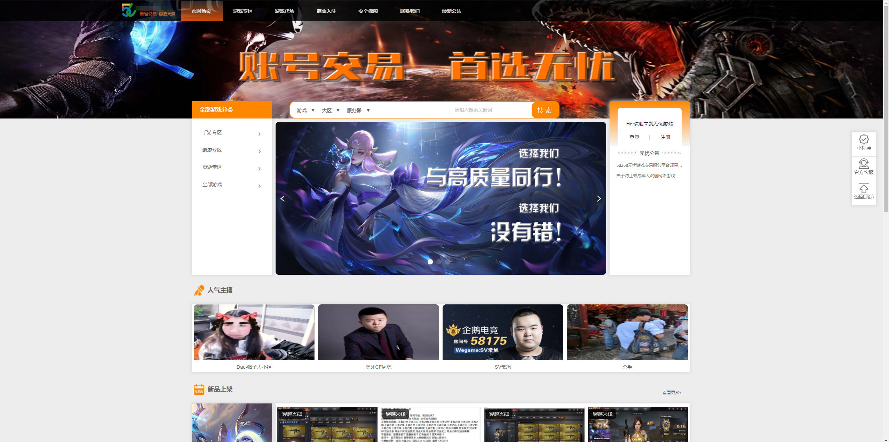
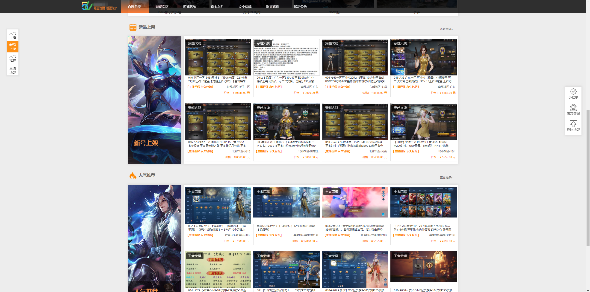
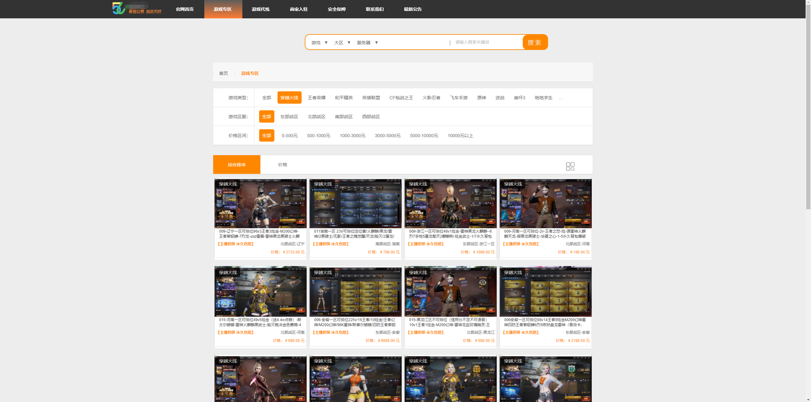
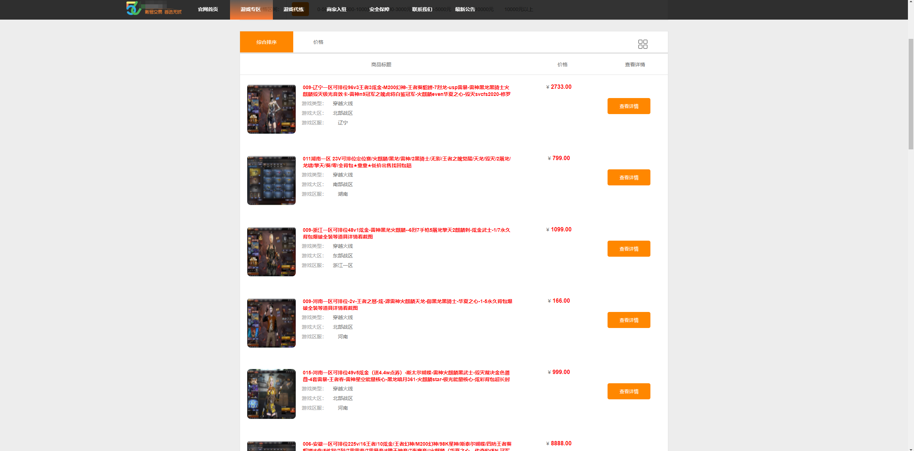
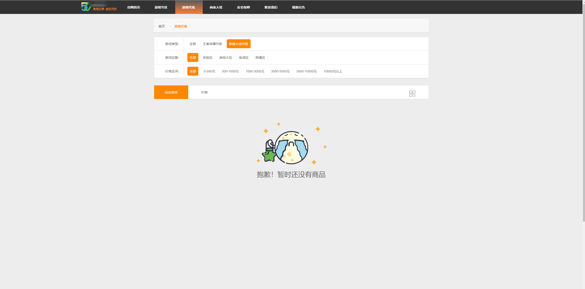
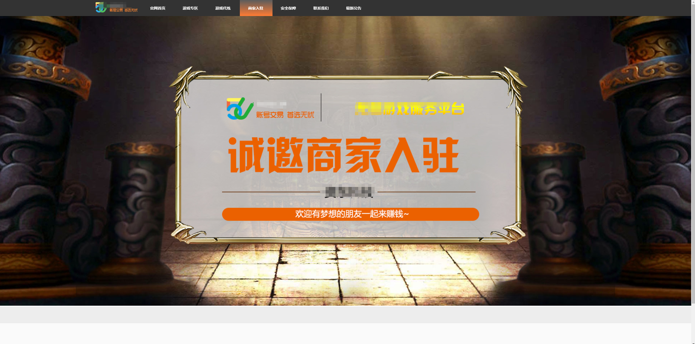
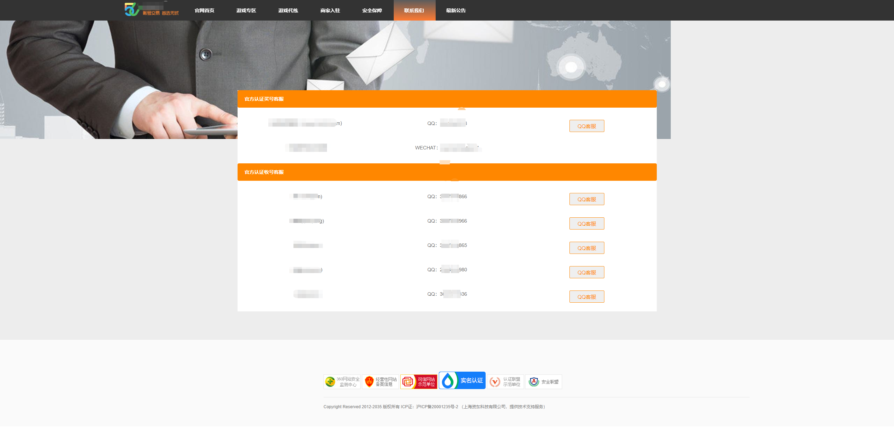
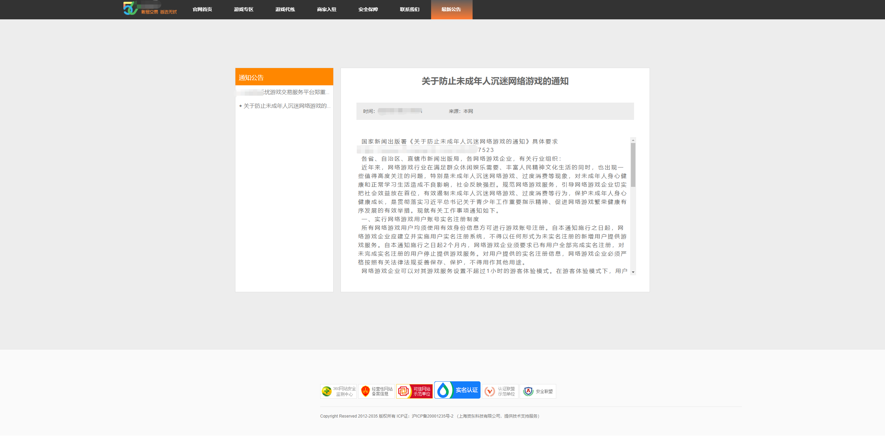
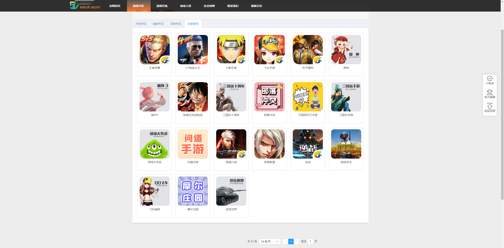

# game-account-trading-platform (游戏账号交易平台-电脑端PC)

#### 介绍
游戏账号交易平台，是专门为网络游戏提供相关交易服务的电子商务平台，主要从事网络游戏账号的交易。 随着近年网络游戏产业的爆炸式增长，虚拟物品的交易需求也随之出现，为满足这部分需求，网游交易平台成为一种应运而生的新生事物而迅猛发展，相对应的游戏账号交易平台也应运而生，就像随着房地产业的快速发展，房地产中介也水涨船高一样。

#### 软件架构
软件架构说明：包含电脑端PC，手机端H5,后台管理系统

#### 安装教程

1.  联系我wx: jackyu001，提供线上支持服务。

#### 使用说明

1.  安装简单，一键部署。支持21种游戏上号。以及发售。
2.  支持游戏分站功能。
3.  前后端分离，java提供后台接口支持。

#### 电脑端PC页面展示

